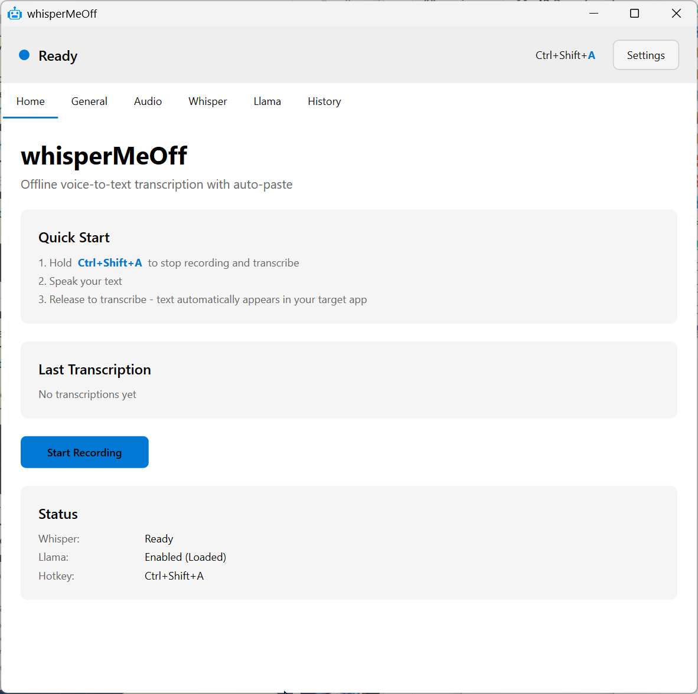
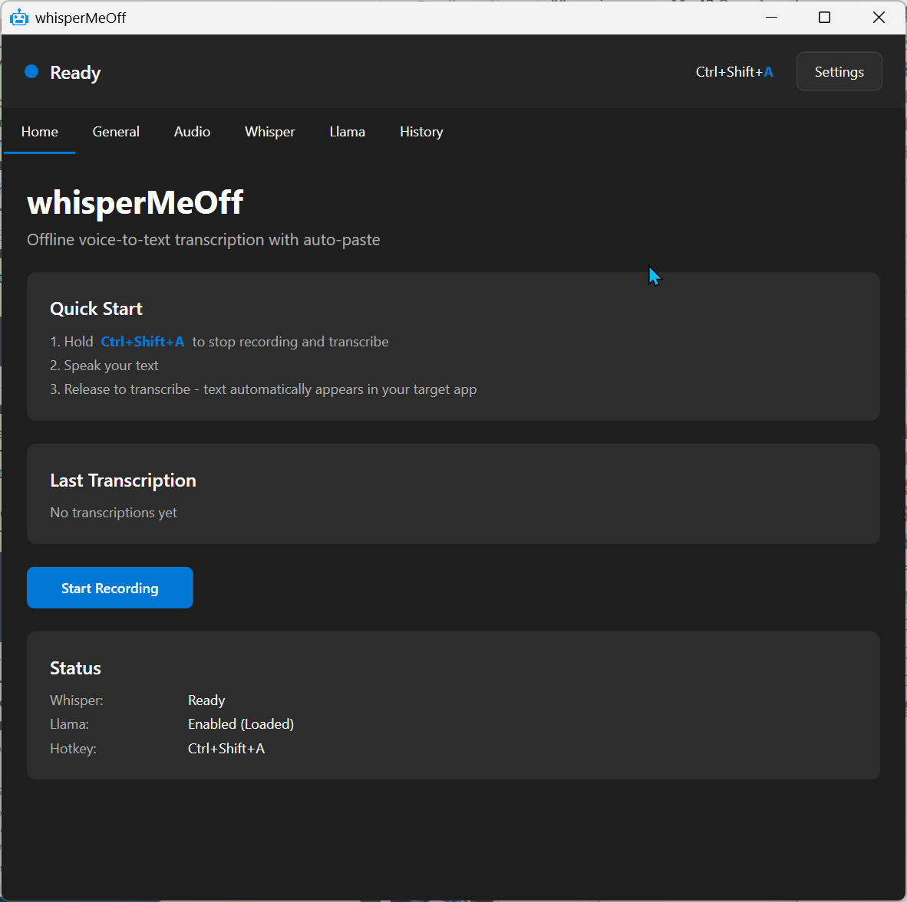
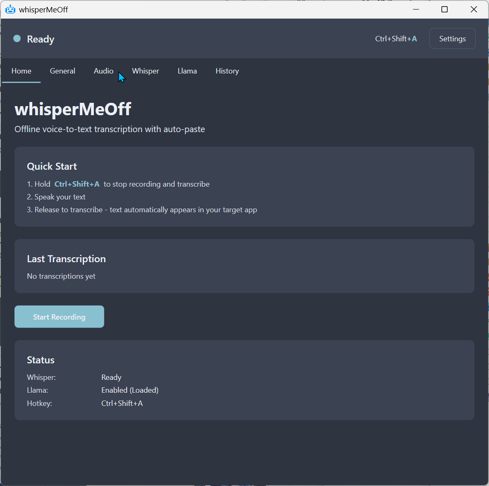
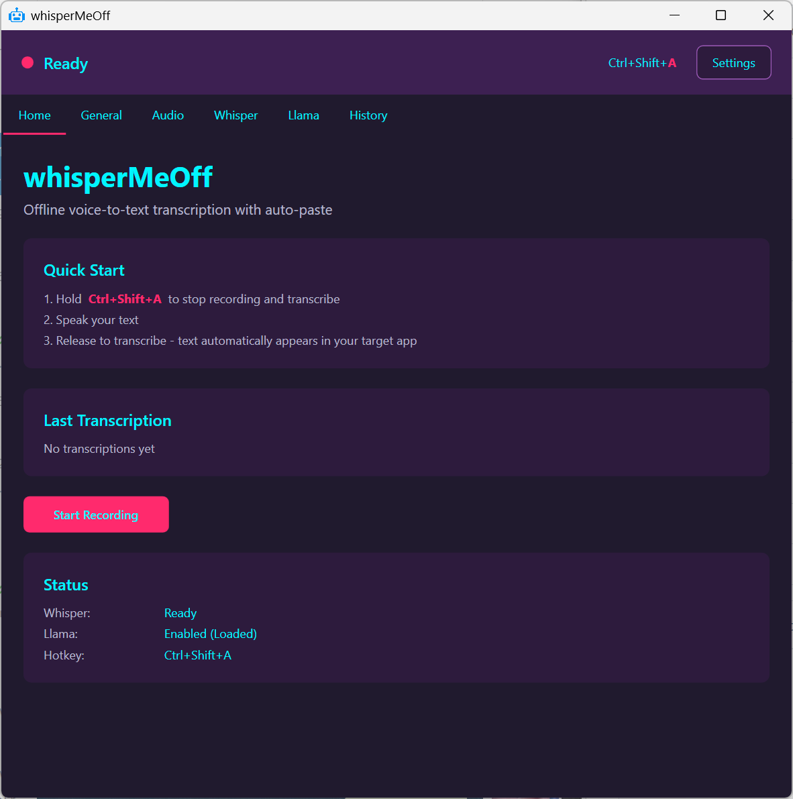
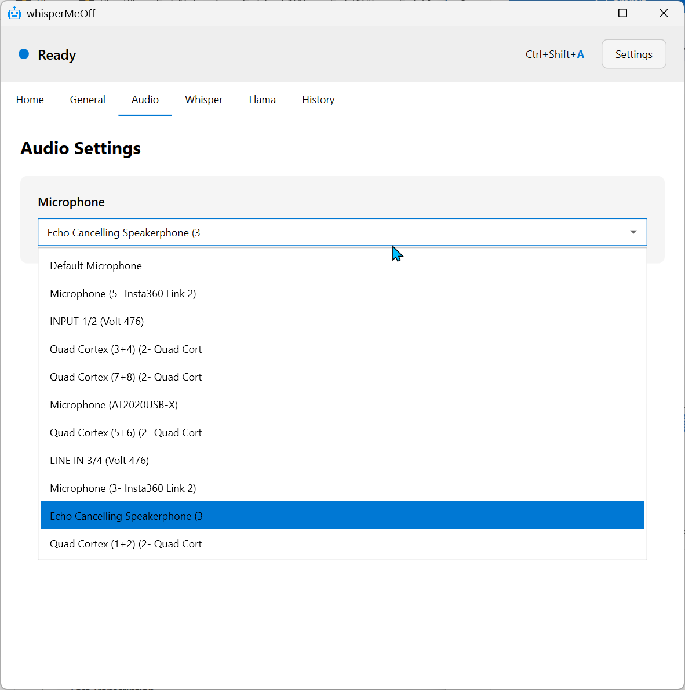
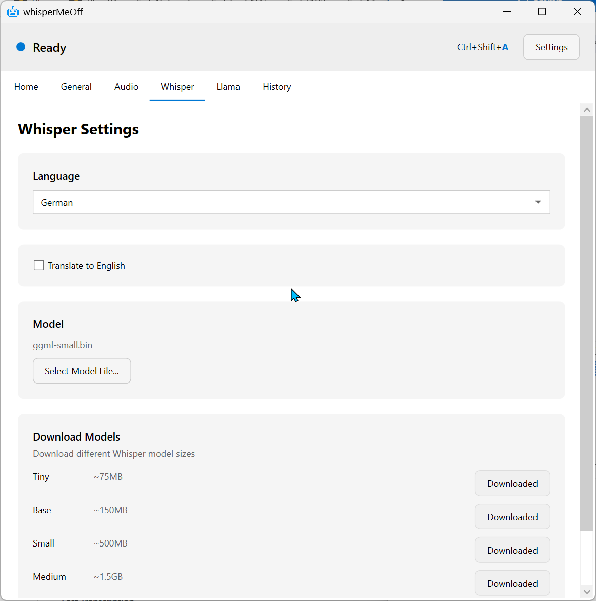
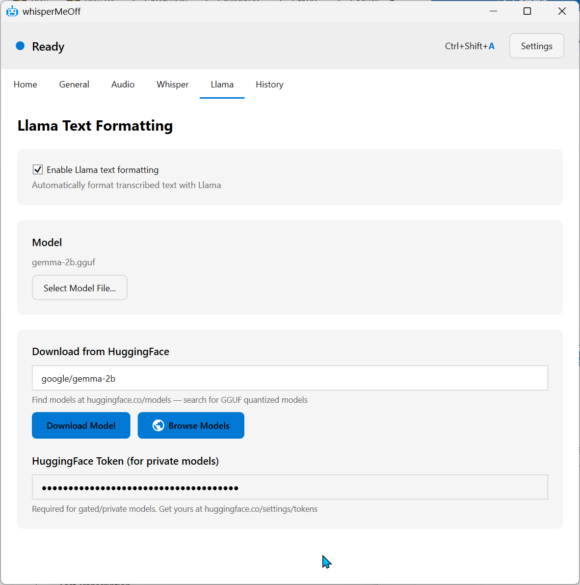
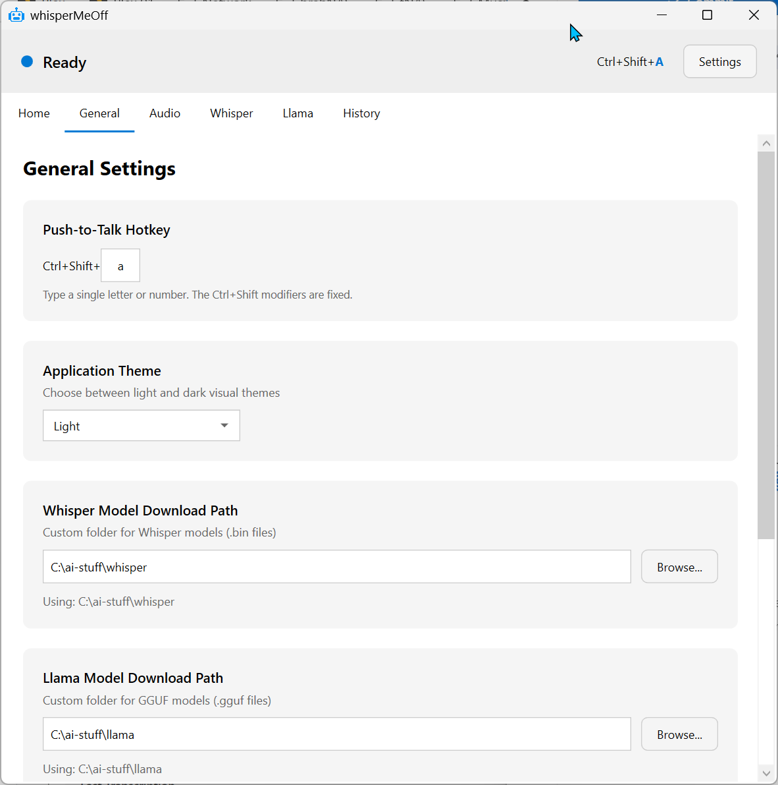
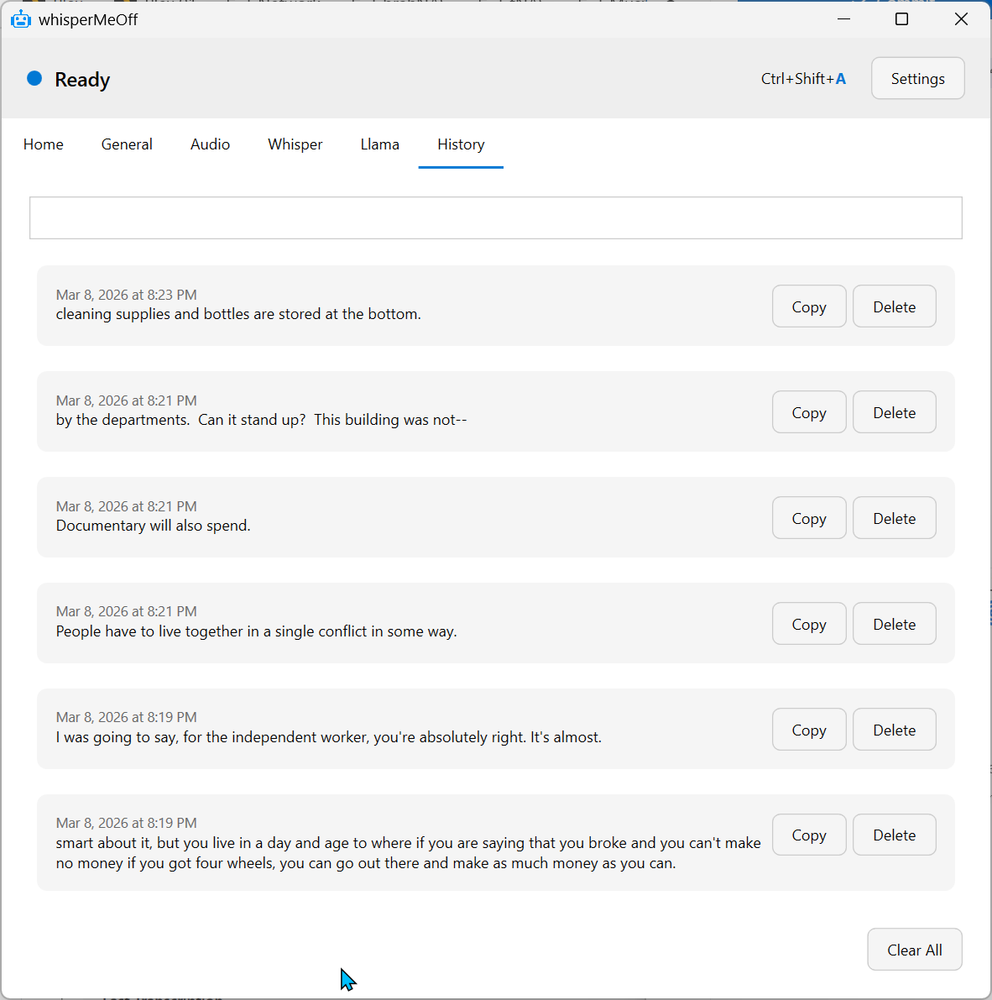

# whisperMeOff

**WhisperMeOff** is a powerful, privacy-first voice-to-text app that runs entirely on your machine using cutting-edge AI. Built on **whisper.cpp** (the blazing-fast C++ port of OpenAI's Whisper) and powered by **llama.cpp** for intelligent text formatting, it delivers professional-quality transcription without ever sending your voice to the cloud.

Hold a hotkey, speak your mind, and watch your words appear — automatically pasted into whatever app you were using. No subscriptions, no account required, no data leaves your computer.

## Features

- **Voice Recording**: Hold `Ctrl+Shift+R` to start recording, release to transcribe
- **Auto-Paste**: Automatically pastes transcribed text to the previously active window
- **Whisper.cpp Powered**: State-of-the-art local speech recognition using OpenAI's Whisper models (tiny to large)
- **Llama.cpp Text Formatting**: Optional AI-powered formatting cleans up your transcription with proper punctuation and paragraphs
- **100% Offline**: Works completely offline - no internet required after model download
- **HuggingFace Integration**: Download GGUF quantized models directly from HuggingFace
- **7 Visual Themes**: Light, Dark, Nord, Dracula, Gruvbox, Monokai, and Synthwave themes
- **System Tray**: Run in background - record without the app being active
- **Minimize to Tray**: Option to minimize to system tray instead of taskbar

## Top Benefits

- **Boosts Productivity**: Speak 3x faster than you type. Capture ideas instantly without breaking your workflow.
- **Improves Accessibility**: A voice-first interface makes content creation accessible to everyone, regardless of typing ability.
- **Enables Hands-Free Use**: Keep your hands on the keyboard or mouse while capturing your thoughts via voice.
- **Reduces Typing Errors**: Voice transcription eliminates typos and spelling mistakes from your workflow.
- **Cuts Injury Risk**: Reduce strain on your hands and wrists from excessive typing - ideal for those with RSI or carpal tunnel.
- **Enhances Focus and Flow**: Stay in the zone by capturing thoughts naturally without interrupting your creative process.
- **Saves Time Overall**: Less time typing means more time for what actually matters - creating and thinking.
- **Adapts to Users**: Choose from multiple Whisper model sizes and Llama formatting options to match your needs and hardware.

## Screenshots

### Theme Previews
<table>
<tr>
<td></td>
<td></td>
</tr>
<tr>
<td align="center"><b>Light</b></td>
<td align="center"><b>Dark</b></td>
</tr>
<tr>
<td></td>
<td></td>
</tr>
<tr>
<td align="center"><b>Nord</b></td>
<td align="center"><b>Synthwave</b></td>
</tr>
</table>

### App Screens
<table>
<tr>
<td></td>
<td></td>
</tr>
<tr>
<td align="center"><b>Audio Settings</b></td>
<td align="center"><b>Whisper Settings</b></td>
</tr>
<tr>
<td></td>
<td></td>
</tr>
<tr>
<td align="center"><b>Llama Settings</b></td>
<td align="center"><b>General Settings</b></td>
</tr>
<tr>
<td></td>
<td></td>
</tr>
<tr>
<td align="center"><b>History</b></td>
<td align="center"><b>Home</b></td>
</tr>
</table>


## Requirements

- Windows 10/11
- .NET 10.0 Runtime

## Dependencies & NuGet Packages

This project uses the following NuGet packages:

### Audio & Transcription
| Package | Version | Description |
|---------|---------|-------------|
| [NAudio](https://github.com/naudio/NAudio) | 2.2.1 | Audio capture and playback library for Windows |
| [Whisper.net](https://github.com/sandrohanea/whisper.net) | 1.9.1-preview1 | .NET binding for Whisper.cpp |
| [Whisper.net.Runtime](https://github.com/sandrohanea/whisper.net) | 1.9.1-preview1 | Runtime components for Whisper |

### AI & ML
| Package | Version | Description |
|---------|---------|-------------|
| [LLamaSharp](https://github.com/ggerganov/llama.cpp) | 0.11.1 | .NET binding for llama.cpp |
| [LLamaSharp.Backend.Cpu](https://github.com/ggerganov/llama.cpp) | 0.11.1 | CPU backend for LLamaSharp |

### UI & Desktop
| Package | Version | Description |
|---------|---------|-------------|
| [Hardcodet.NotifyIcon.Wpf](https://github.com/hardcodet/wpf-notifyicon) | 1.1.0 | System tray icon support for WPF |
| [CommunityToolkit.Mvvm](https://github.com/CommunityToolkit/dotnet) | 8.2.2 | MVVM toolkit for WPF apps |

### Data & Utilities
| Package | Version | Description |
|---------|---------|-------------|
| [Microsoft.Data.Sqlite](https://docs.microsoft.com/en-us/dotnet/standard/data/sqlite/) | 8.0.0 | SQLite database support |
| [MathNet.Numerics](https://numerics.mathdotnet.com/) | 5.0.0 | Numerical computing library |

## Installation

1. Download the latest release
2. Run `whisperMeOff.exe`
3. The app will guide you through initial setup

## Usage

### Quick Start

1. **Select a Whisper Model**: Go to the Whisper tab and download a model
2. **Set Hotkey**: The default is `Ctrl+Shift+R` (you can change this in General settings)
3. **Start Recording**: Hold `Ctrl+Shift+R` to start recording
4. **Release to Transcribe**: Release the keys to stop recording and transcribe
5. **Auto-Paste**: The transcribed text is automatically pasted to your previous window

### Configuration

#### Whisper Settings
- **Language**: Select the language or use "Auto Detect"
- **Translate**: Enable to translate output to English
- **Model**: Select a Whisper model size (tiny, base, small, medium, large)

#### Llama Settings (Optional)
- Enable Llama text formatting for cleaner output
- Download models from HuggingFace (search for GGUF quantized models)
- Enter your HuggingFace token for private models

#### General Settings
- **Hotkey**: Change the trigger key (default: R)
- **Download Paths**: Customize where models are saved
- **Recording Mode**: Choose Push-to-talk (hold to record) or Toggle (press to start/stop)
- **Clipboard**: Configure clipboard restore behavior
- **Theme**: Choose from 6 visual themes (Light, Dark, Nord, Dracula, Gruvbox, Monokai)

## Model Sizes

| Model | Size | Accuracy |
|-------|------|----------|
| Tiny | ~75 MB | Low |
| Base | ~150 MB | Medium |
| Small | ~500 MB | Good |
| Medium | ~1.5 GB | Better |
| Large | ~3 GB | Best |

## Keyboard Shortcuts

| Shortcut | Action |
|----------|--------|
| Ctrl+Shift+R | Start/Stop recording |

## Building from Source

```bash
dotnet build
```

## License

MIT License
