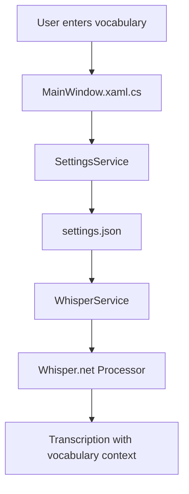

# Custom Vocabulary Feature - Version 1.2.0

## Feature Overview
Enable users to define custom word lists that improve Whisper recognition accuracy for domain-specific terminology, names, or frequently used phrases.

## Architecture

### Mermaid Diagram - Data Flow


## Implementation Plan

### Step 1: Analyze Whisper.net API
- **Approach**: Use `WithInitialPrompt()` method available in WhisperBuilder
- **Why**: Initial prompt is well-supported in Whisper.net and effectively guides recognition
- **Alternative considered**: Logit bias (word boosting) - not fully exposed in current Whisper.net version

### Step 2: Add Custom Vocabulary to Settings
- **File**: `Services/SettingsService.cs`
- **Add**: `CustomVocabulary` property to `WhisperSettings` class
- **Type**: `string` - multi-line text containing words/phrases (one per line)

### Step 3: Update WhisperService
- **File**: `Services/WhisperService.cs`
- **Modify**: `TranscribeAsync()` method
- **Implementation**: Apply vocabulary as initial prompt using `.WithInitialPrompt()`

### Step 4: Add Custom Vocabulary UI
- **File**: `Views/MainWindow.xaml`
- **Location**: Whisper tab, after Model Selection section
- **Components**:
  - Label: "Custom Vocabulary"
  - TextBox: Multi-line input for vocabulary words/phrases
  - Help text: Instructions for format (one word/phrase per line)
  - Save indicator

### Step 5: Add Code-Behind Handlers
- **File**: `Views/MainWindow.xaml.cs`
- **Add**: 
  - `CustomVocabularyTextBox_TextChanged()` handler
  - Load vocabulary from settings on startup
  - Save to settings when changed

### Step 6: Version Update
- **File**: `whisperMeOff.csproj`
- **Change**: Version from `1.1.1` to `1.2.0`

## UI Mockup

```
┌─────────────────────────────────────────────┐
│ Custom Vocabulary                           │
│ ┌─────────────────────────────────────────┐ │
│ │ word1                                    │ │
│ │ phrase one                               │ │
│ │ specialterm                              │ │
│ │ ...                                      │ │
│ └─────────────────────────────────────────┘ │
│ One word or phrase per line. These words   │
│ will be more likely to be recognized.       │
└─────────────────────────────────────────────┘
```

## Files to Modify

| File | Changes |
|------|---------|
| `Services/SettingsService.cs` | Add `CustomVocabulary` to `WhisperSettings` |
| `Services/WhisperService.cs` | Apply vocabulary as initial prompt in `TranscribeAsync()` |
| `Views/MainWindow.xaml` | Add Custom Vocabulary UI panel |
| `Views/MainWindow.xaml.cs` | Add load/save handlers |
| `whisperMeOff.csproj` | Update version to 1.2.0 |

## Technical Details

### Whisper Initial Prompt
- Whisper uses the initial prompt to provide context for transcription
- The prompt helps Whisper understand the domain/tone
- Maximum prompt length: ~2000 characters recommended
- Works best with 1-50 words/phrases

### Settings Storage
```json
{
  "Whisper": {
    "ModelPath": "",
    "ModelSize": "medium",
    "Language": "auto",
    "Translate": false,
    "CustomVocabulary": "word1\nword2\nphrase one"
  }
}
```
