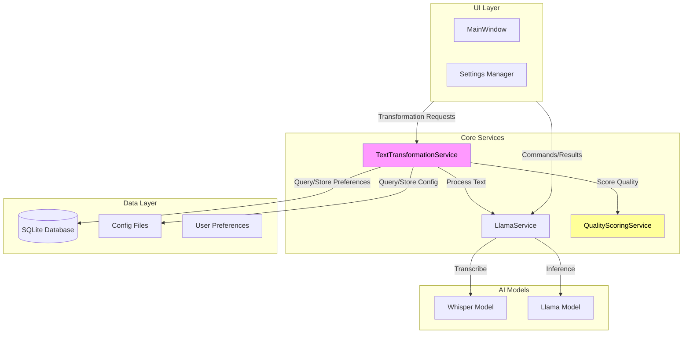
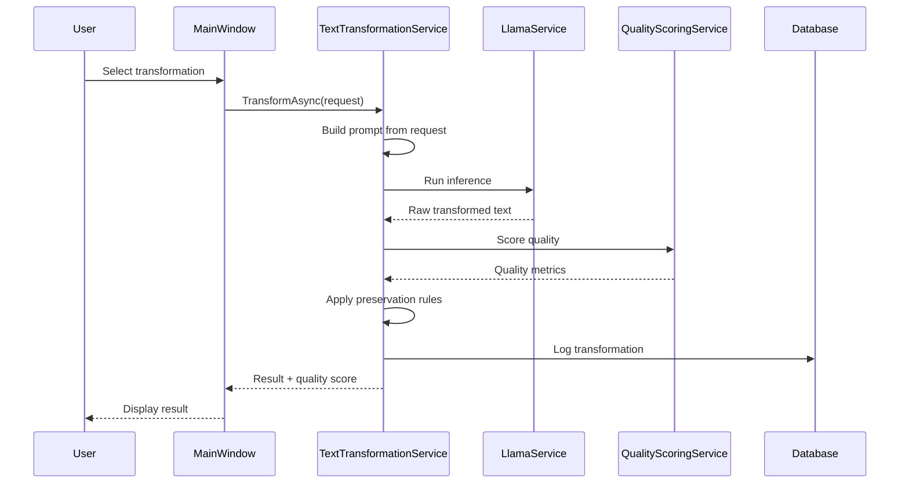
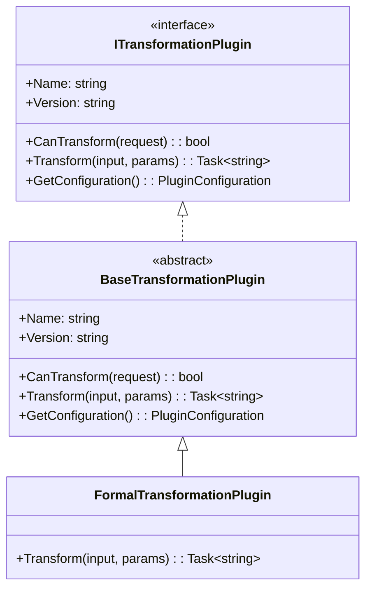

# Text Transformation Feature - Architectural Plan

## 1. Executive Summary

This document outlines the architecture for adding advanced text transformation capabilities to whisperMeOff. The feature extends the current LlamaService to support grammatical restructuring, tone modulation, and personalized style adjustments beyond the existing basic formatting and translation features.

## 2. System Architecture Overview



## 3. Key Components

### 3.1 TextTransformationService (New)

**Purpose**: Central orchestration layer for all text transformations

**Location**: `Services/TextTransformationService.cs`

**Responsibilities**:
- Accept transformation requests with parameters
- Coordinate transformation pipeline
- Manage transformation history
- Handle priority queue for batch processing
- Integrate with quality scoring

**Public Interface**:
```csharp
public interface ITextTransformationService
{
    Task<string> TransformAsync(string input, TransformationRequest request);
    Task<IEnumerable<TransformationResult>> TransformBatchAsync(IEnumerable<string> inputs, TransformationRequest request);
    Task<IEnumerable<TransformationType>> GetAvailableTransformationsAsync();
    Task<TransformationProfile> GetProfileAsync(string profileId);
    Task SaveProfileAsync(TransformationProfile profile);
    event EventHandler<TransformationProgressEventArgs>? ProgressChanged;
}
```

### 3.2 TransformationRequest Model

```csharp
public class TransformationRequest
{
    public TransformationType Type { get; set; }
    public ToneType TargetTone { get; set; }
    public VoiceType Voice { get; set; } // passive/active
    public ComplexityLevel Complexity { get; set; } // simplified/elaborated
    public string? ProfileId { get; set; }
    public PreservationSettings Preservation { get; set; }
    public ProcessingMode Mode { get; set; }
}

public class PreservationSettings
{
    public bool PreserveProperNouns { get; set; } = true;
    public bool PreserveTechnicalTerms { get; set; } = true;
    public bool PreserveAcronyms { get; set; } = true;
    public List<string> CustomProtectedWords { get; set; } = new();
}
```

### 3.3 TransformationProfile Model

```csharp
public class TransformationProfile
{
    public string Id { get; set; }
    public string Name { get; set; }
    public string Description { get; set; }
    public List<TransformationSetting> Settings { get; set; }
    public bool IsDefault { get; set; }
    public DateTime CreatedAt { get; set; }
    public DateTime LastUsedAt { get; set; }
}

public class TransformationSetting
{
    public TransformationType Type { get; set; }
    public Dictionary<string, object> Parameters { get; set; }
}
```

### 3.4 QualityScoringService (New)

**Purpose**: Validate transformation quality and measure user satisfaction

**Location**: `Services/QualityScoringService.cs`

**Responsibilities**:
- Compute semantic similarity between original and transformed text
- Detect potential meaning loss or distortion
- Track transformation quality metrics
- Learn from user corrections/feedback

**Metrics to Track**:
- Semantic similarity score (0-1)
- Length preservation ratio
- Grammar correctness
- User满意度 scores (via explicit feedback or implicit correction patterns)

## 4. Transformation Types

### 4.1 Formal/Informal Conversion

| Type | Description | Example Input | Example Output |
|------|-------------|---------------|----------------|
| Formal | Professional, polite tone | "hey, can u send me the file?" | "Could you please send me the file?" |
| Informal | Casual, friendly tone | "Please kindly review the document at your earliest convenience." | "Hey, can you check out the doc when you get a chance?" |

### 4.2 Voice Transformation

| Type | Description | Example Input | Example Output |
|------|-------------|---------------|----------------|
| Passive to Active | Convert passive constructions to active | "The report was written by the team." | "The team wrote the report." |
| Active to Passive | Convert active constructions to passive | "The team wrote the report." | "The report was written by the team." |

### 4.3 Complexity Adjustment

| Type | Description | Example Input | Example Output |
|------|-------------|---------------|----------------|
| Simplify | Reduce complexity for broader audience | "The implementation utilizes a microservices architecture." | "The system uses small, separate services." |
| Elaborate | Add detail and complexity | "The meeting is at 3pm." | "The team sync meeting is scheduled for 3:00 PM in Conference Room B." |

### 4.4 Professional vs Casual Tone

| Type | Description | Example Input | Example Output |
|------|-------------|---------------|----------------|
| Professional | Business-appropriate language | "Awesome work on the project!" | "Excellent work on the project." |
| Casual | Relaxed, friendly language | "Please ensure the deliverables are submitted by EOD." | "Don't forget to get those files in by end of day!" |

### 4.5 User-Specific Personalization

- Custom vocabulary mapping (e.g., always replace "resource" with "team member")
- Preferred phrasing patterns
- Industry-specific terminology preservation
- Custom abbreviation expansions

## 5. Data Flow

### 5.1 Single Transformation Flow



### 5.2 Prompt Engineering Strategy

Each transformation type uses a structured prompt template:

```csharp
public static class TransformationPrompts
{
    public const string FormalConversion = @"Convert the following text to a formal, professional tone.
Preserve proper nouns, technical terms, and acronyms.
Input: {input}
Output:";

    public const string InformalConversion = @"Convert the following text to a casual, informal tone.
Keep it natural and friendly.
Input: {input}
Output:";

    public const string PassiveToActive = @"Convert passive voice to active voice in the following text.
Input: {input}
Output:";

    public const string Simplify = @"Simplify the following text to make it easier to understand.
Use simpler words and shorter sentences while preserving the meaning.
Input: {input}
Output:";

    public const string Elaborate = @"Add more detail and clarity to the following text.
Expand abbreviations and add relevant context.
Input: {input}
Output:";

    public const string PreserveTemplate = @"Transform the following text according to: {profile_name}.
Preserve these terms exactly: {protected_terms}
Input: {input}
Output:";
}
```

## 6. Edge Case Handling

### 6.1 Proper Noun Preservation

- Maintain case sensitivity for names, places, organizations
- Use named entity recognition patterns
- Allow user-defined protected terms list
- Handle hyphenated terms and compound names

### 6.2 Technical Terminology

- Detect domain-specific jargon
- Preserve acronyms without expansion
- Maintain code snippets and technical formatting
- Handle mathematical notation

### 6.3 Meaning Fidelity

- Compare semantic embedding before/after transformation
- Flag transformations with >20% meaning deviation
- Provide original vs transformed diff view
- Allow rollback to original

## 7. Extensibility Design

### 7.1 Plugin Architecture



### 7.2 Adding New Transformation Types

1. Create new class inheriting from `BaseTransformationPlugin`
2. Implement `TransformAsync` method with custom prompt
3. Register in `TransformationPluginRegistry`
4. Add UI option in transformation selector

## 8. Processing Modes

### 8.1 Real-Time Processing

- Applied immediately during/after transcription
- Lower latency requirements (<500ms target)
- Use cached prompts and lightweight scoring
- Best for: automatic formatting preferences

### 8.2 On-Demand Processing

- User triggers after seeing initial transcription
- Full quality validation
- Multiple transformation options
- Best for: complex transformations, user-specific profiles

### 8.3 Batch Processing

- Queue multiple transformations
- Process in background thread
- Progress reporting
- Best for: processing history, bulk re-formatting

## 9. API Design for Third-Party Integration

### 9.1 Internal API (for future extensibility)

```csharp
public interface ITransformationApi
{
    // Synchronous transformation
    Task<TransformationResponse> Transform(TransformationRequest request);
    
    // Streaming transformation (for long texts)
    IAsyncEnumerable<string> TransformStream(TransformationRequest request, CancellationToken ct);
    
    // Profile management
    Task<TransformationProfile> CreateProfile(TransformationProfile profile);
    Task UpdateProfile(string id, TransformationProfile profile);
    Task DeleteProfile(string id);
    Task<IEnumerable<TransformationProfile>> GetProfiles();
    
    // Quality feedback
    Task SubmitFeedback(TransformationFeedback feedback);
}
```

### 9.2 Event Model

```csharp
public class TransformationProgressEventArgs : EventArgs
{
    public int Current { get; set; }
    public int Total { get; set; }
    public string CurrentOperation { get; set; }
    public double ProgressPercentage => Total > 0 ? (double)Current / Total * 100 : 0;
}
```

## 10. User Preference Storage

### 10.1 Database Schema (SQLite Extension)

```sql
-- Transformation Profiles
CREATE TABLE TransformationProfiles (
    Id TEXT PRIMARY KEY,
    Name TEXT NOT NULL,
    Description TEXT,
    SettingsJson TEXT NOT NULL,
    IsDefault INTEGER DEFAULT 0,
    CreatedAt TEXT NOT NULL,
    LastUsedAt TEXT
);

-- Transformation History
CREATE TABLE TransformationHistory (
    Id INTEGER PRIMARY KEY AUTOINCREMENT,
    InputText TEXT NOT NULL,
    OutputText TEXT NOT NULL,
    TransformationType TEXT NOT NULL,
    QualityScore REAL,
    ProfileId TEXT,
    CreatedAt TEXT NOT NULL,
    FOREIGN KEY (ProfileId) REFERENCES TransformationProfiles(Id)
);

-- User Preferences
CREATE TABLE TransformationPreferences (
    Key TEXT PRIMARY KEY,
    Value TEXT NOT NULL,
    UpdatedAt TEXT NOT NULL
);
```

## 11. Quality Measurement

### 11.1 Automated Metrics

- **Semantic Similarity**: Use embedding model to compare input/output meaning
- **Length Ratio**: Track percentage change in text length
- **Grammar Score**: Verify output grammar correctness
- **Readability Score**: Flesch-Kincaid or similar

### 11.2 User Satisfaction Tracking

- Explicit rating system (1-5 stars)
- Implicit correction detection (user undoes transformation)
- Usage frequency analytics
- Profile adoption rates

## 12. Implementation Priorities

### Phase 1: Core Infrastructure
- [ ] Extend ILlamaService with new transformation methods
- [ ] Create TextTransformationService
- [ ] Implement basic prompt templates
- [ ] Add preservation settings

### Phase 2: UI Integration
- [ ] Add transformation type selector in MainWindow
- [ ] Implement profile management UI
- [ ] Add quality score display

### Phase 3: Advanced Features
- [ ] Implement QualityScoringService
- [ ] Add batch processing support
- [ ] Create plugin architecture
- [ ] Implement user preference learning

## 13. Configuration Options

### 13.1 App Settings

```csharp
public class TransformationSettings
{
    // Default transformation applied to all transcriptions
    public TransformationType DefaultTransformation { get; set; } = TransformationType.FormatOnly;
    
    // Whether to apply transformations automatically or on-demand
    public bool AutoTransform { get; set; } = false;
    
    // Quality threshold - warn if below this score
    public double MinQualityThreshold { get; set; } = 0.7;
    
    // Preserve settings
    public PreservationSettings Preservation { get; set; } = new();
    
    // Processing preferences
    public ProcessingMode PreferredMode { get; set; } = ProcessingMode.OnDemand;
    
    // User profile ID for personalized transformations
    public string? ActiveProfileId { get; set; }
}
```

## 14. Summary

This architecture provides:

1. **Modular design**: Each transformation type is isolated and extensible
2. **Quality assurance**: Built-in scoring and validation
3. **User personalization**: Profiles and preference storage
4. **Privacy-first**: All processing remains local via Llama.cpp
5. **Future-proof**: Plugin architecture allows adding new transformations
6. **Flexible processing**: Supports real-time, on-demand, and batch modes

The design maintains backward compatibility with existing FormatTextAsync and TranslateTextAsync methods while adding substantial new capability for grammatical, tone, and style transformations.
